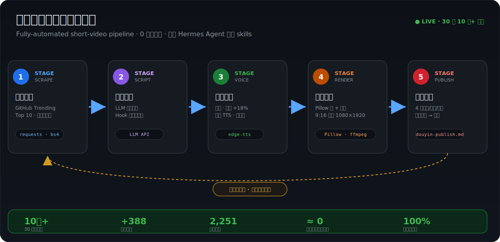

<div align="center">

# Hermes Skills

**EN —** Production-ready [Agent Skills](https://hermes-agent.nousresearch.com/docs) for Hermes, Claude Code, Cursor, and Codex. The flagship skill drives a **fully-automated short-video pipeline** — trend-scraping → LLM scripting → edge-tts → ffmpeg → auto-publish, with **100k+ views in 30 days, zero manual editing**.

**中文 —** 基于 [Hermes Agent](https://hermes-agent.nousresearch.com) 自研的一套生产级 Agent Skills，兼容 Claude Code / Cursor / Codex。头牌 skill 驱动一条**全自动短视频内容流水线**：热点抓取 → LLM 文案 → edge-tts 配音 → ffmpeg 合成 → 自动发布，**30 天 10 万+ 播放，单条成片人工耗时 ≈ 0**。

<a id="skills-gallery"></a>

<table>
<tr>
<td colspan="2" align="center" valign="top">
<a href="#github-trending-douyin"></a>
<br/><a href="#github-trending-douyin"><strong>github-trending-douyin</strong></a>
<br/><sub>全自动短视频流水线 · 30 天 10 万+ 播放</sub>
</td>
</tr>
<tr>
<td width="50%" valign="top">
<a href="#bilibili-blogger-tracker"></a>
<br/><a href="#bilibili-blogger-tracker"><strong>bilibili-blogger-tracker</strong></a>
<br/><sub>视频追踪 / 内容提取</sub>
</td>
<td width="50%" valign="top">
<a href="#web-video-auto-render"></a>
<br/><a href="#web-video-auto-render"><strong>web-video-auto-render</strong></a>
<br/><sub>视频渲染 / 自动化</sub>
</td>
</tr>
</table>

[](./LICENSE)
[](https://github.com/hermes-agent/hermes-skills/stargazers)
[](#contributing)
[](#skills-gallery)

</div>

---

## 目录 · Table of contents

| 安装 Install | Skills | 贡献 Contribute |
|---|---|---|
| [安装](#安装--install)<br>[`npx skills add`](#a--npx-skills-cli)<br>[手动复制](#b--手动复制)<br>[Git submodule](#c--git-submodule) | [`github-trending-douyin`](#github-trending-douyin) ⭐<br>[`bilibili-blogger-tracker`](#bilibili-blogger-tracker)<br>[`web-video-auto-render`](#web-video-auto-render) | [贡献](#贡献--contributing)<br>[License](#license) |

---

## ⭐ 头牌 · `github-trending-douyin`

**EN —** A zero-touch content agent: every day it scrapes GitHub Trending, writes a hook-driven voiceover script with an LLM, synthesizes narration with edge-tts, renders a vertical (9:16) video with Pillow + ffmpeg, and produces ready-to-post Douyin copy — **end to end, no human in the loop**.

一个 **0 人工干预**的内容 Agent：每天自动从 GitHub Trending 抓取热点 → LLM 生成口播文案 → edge-tts 合成配音 → Pillow + ffmpeg 自动剪辑成竖版成片 → 生成抖音标题/描述/话题。已稳定产出真实流量。

<p align="center">
  
</p>

### 真实数据（近 30 天）

| 指标 | 数值 |
|------|------|
| 播放量 | **10 万+** |
| 净增粉丝 | **+388** |
| 作品点赞 | **2,251** |
| 单条成片人工耗时 | **≈ 0**（全自动） |

> **说明（诚实边界）：** 本目录是**在 Hermes Agent 框架之上的 skill 层**，不包含框架本身——编排/调度复用 Hermes Agent，选题 → 脚本 → 配音 → 合成 → 发布的全部 skill 实现为自研。
> 为保护核心配方，仓库只公开**架构图 + 1 个代表性可运行脚本 + overview 版 SKILL.md**；完整 Hook 模板库、16 条渲染踩坑与发布策略保留在私有版本。

链接：[详细说明](./github-trending-douyin/README.md) · [SKILL.md（overview）](./github-trending-douyin/SKILL.md) · [架构图](./github-trending-douyin/architecture.svg) · [代表性代码 `fetch_trending.py`](./github-trending-douyin/scripts/fetch_trending.py)

---

## Skills

### `github-trending-douyin`

**类别：** 内容创作 / 自动化
**适合：** GitHub Trending 选题、竖版短视频自动成片、抖音发布文案生成、全自动内容流水线。

三阶段全自动：① 数据采集（爬 Trending，按 star 增长量排序）→ ② 视频制作（口播脚本 → TTS → Pillow 帧渲染 → ffmpeg 合成 → 字幕烧录）→ ③ 发布文案（4 套标题/描述/话题，推荐最优）。

亮点：

- **零人工成片** — 从选题到发布文案全程自动，单条人工耗时 ≈ 0
- **竖版渲染管线** — 容器内无 Playwright，改用 Pillow 直接绘制 GitHub 暗色风格卡片帧；中文 + emoji 混合渲染
- **质量门控** — 渲染后强制跑 `verify_emoji.py`，emoji/字形检测不过就不合成视频
- **回头客上下文** — 维护项目知识库，识别连续上榜 / 排名跃升 / 首次亮相，让口播关联历史
- **真实流量** — 近 30 天 10 万+ 播放、+388 粉、2,251 赞

链接：[README](./github-trending-douyin/README.md) · [SKILL.md](./github-trending-douyin/SKILL.md) · [架构图](./github-trending-douyin/architecture.svg) · [`fetch_trending.py`](./github-trending-douyin/scripts/fetch_trending.py)

---

### `bilibili-blogger-tracker`

**类别：** 调研 / 内容追踪
**适合：** 追踪 B 站 UP 主、自动检测新视频、评论区图片提取、知识库入库、cron 监控。

`bilibili-blogger-tracker` 自动化追踪 B 站创作者的完整流程：检测新投稿、提取内容（优先抓取 UP 主置顶评论里的结构化图片——信息最全、带链接）、入库到个人知识库，并配好自动监控。

亮点：

- **评论图片优先** — 自动检查 UP 主是否在评论里发了结构化总结图（含事件标题 + URL，信息最全的来源）
- **4 级内容提取** — 评论图片 → 字幕 → 简介/标签重建 → 跨平台搜索
- **4 文件 wiki 模式** — 追踪记录、最新视频内容、实体页、汇总/查询页
- **cron 监控** — 无新视频静默跳过，有新内容立即通知
- **限流韧性** — 内置 B 站 API -352/-799/412 的规避方案

Links: [README](./skills/bilibili-blogger-tracker/README.md) · [SKILL.md](./skills/bilibili-blogger-tracker/SKILL.md) · <!-- DOWNLOAD:bilibili-blogger-tracker:start -->
[Download v1.0.0 .zip](https://github.com/hermes-agent/hermes-skills/releases/download/bilibili-blogger-tracker-v1.0.0/bilibili-blogger-tracker-1.0.0.zip)
<!-- DOWNLOAD:bilibili-blogger-tracker:end -->

---

### `web-video-auto-render`

**类别：** 视频 / 自动化
**适合：** 把 Vite+React 演示项目自动渲染成 MP4。Playwright 无头浏览器录制 + ffmpeg 音频合并，零手动录屏。

`web-video-auto-render` 是 `web-video-presentation` 的 Phase 4 增强版。不用 OBS 手动录屏，而是用 Playwright 内置录制在 1920×1080 捕获浏览器画面，再用 ffmpeg 把录制视频和合成音频合并——一条命令搞定。

> 🎬 **Live demo** — 关于 [Hermes Kanban](https://hermes-agent.nousresearch.com) 的 5 分钟演示，由一个含 7 章节、37 段音频的 Vite+React 项目全自动渲染：
>
> [-red?style=for-the-badge&logo=videolan)](./demo/web-video-auto-render/hermes-kanban-demo.mp4)

亮点：

- **零手动录屏** — Playwright 无头 Chromium 原生捕获所有 CSS/Framer Motion 动画
- **两种模式** — 开发用 `?auto=1` 浏览器预览，生产用全自动 Playwright+ffmpeg
- **自带 HTTP server** — 渲染时自起服务，免受进程回收影响
- **抗 OOM** — 拆分 ffmpeg 流水线（webm→mp4、音频 concat、最终合并）避免内存被杀
- **6 条踩坑记录** — webm 时长 N/A、concat 绝对路径、容器限制、中文引号等

Links: [README](./skills/web-video-auto-render/README.md) · [SKILL.md](./skills/web-video-auto-render/SKILL.md) · <!-- DOWNLOAD:web-video-auto-render:start -->
[Download v1.0.0 .zip](https://github.com/hermes-agent/hermes-skills/releases/download/web-video-auto-render-v1.0.0/web-video-auto-render-1.0.0.zip)
<!-- DOWNLOAD:web-video-auto-render:end -->

---

## 安装 · Install

> `github-trending-douyin` 位于仓库根目录，可直接克隆后取用；下方 CLI 适用于 `skills/` 目录下的 skill。

### A · `npx skills` CLI

```bash
# 安装指定 skill
npx skills add hermes-agent/hermes-skills -s bilibili-blogger-tracker

# 安装全部
npx skills add hermes-agent/hermes-skills

# 全局安装（所有项目可用）
npx skills add hermes-agent/hermes-skills -s bilibili-blogger-tracker --global
```

### B · 手动复制

```bash
git clone https://github.com/hermes-agent/hermes-skills.git
cp -r hermes-skills/skills/bilibili-blogger-tracker /path/to/your/project/.skills/
```

### C · Git submodule

```bash
git submodule add https://github.com/hermes-agent/hermes-skills.git .skills/hermes-skills
```

---

## 兼容性 · Compatibility

| Agent | 状态 |
|-------|--------|
| [Hermes Agent](https://hermes-agent.nousresearch.com) | ✅ Native |
| [Claude Code](https://docs.anthropic.com/en/docs/claude-code) | ✅ Compatible |
| [Cursor](https://cursor.sh) | ✅ Compatible |
| [Codex CLI](https://github.com/openai/codex) | ✅ Compatible |
| [OpenCode](https://github.com/opencode-ai/opencode) | ✅ Compatible |
| [Gemini CLI](https://github.com/google-gemini/gemini-cli) | ✅ Compatible |

---

## 贡献 · Contributing

欢迎贡献！新增一个 skill：

1. Fork 本仓库
2. 在 `skills/your-skill-name/` 下创建：
   - `SKILL.md` — skill 提示词（YAML frontmatter：`name`、`description`）
   - `manifest.json` — 元数据（`name`、`version`、`category`、`description`、`compat`）
   - `README.md` — 给人看的文档
   - `references/` — 可选的支撑文件
3. 跑 `npm run validate` 校验
4. 提 PR

---

## License

[MIT](./LICENSE)
